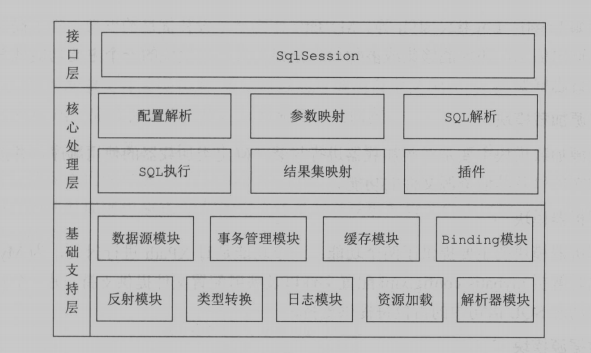
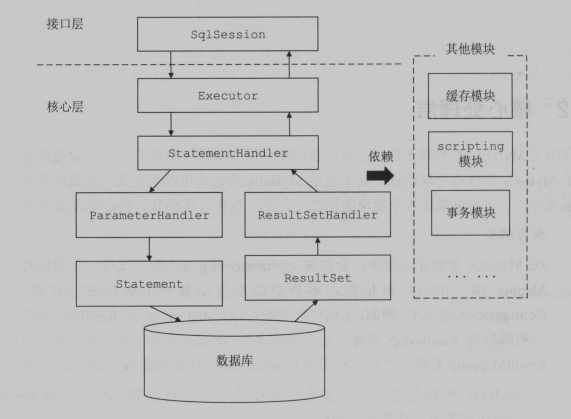
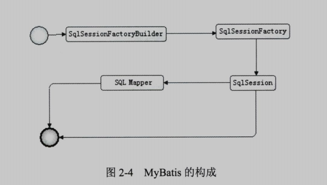
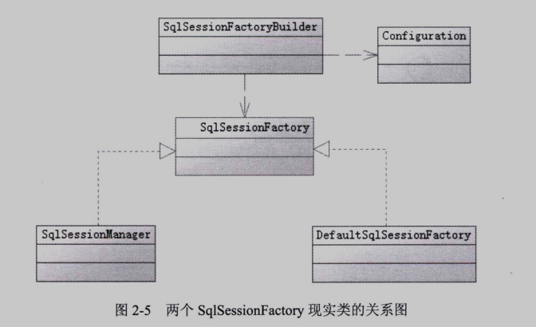
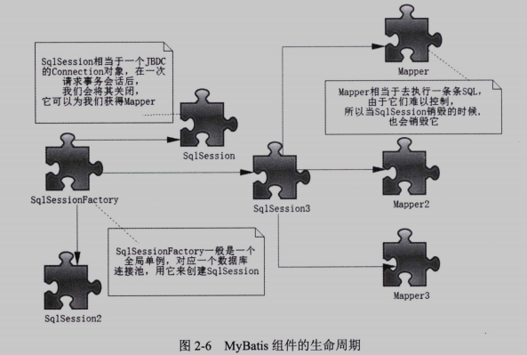

# Mybatis 相关内容整理

## 1. 简介
> 一款优秀的半自动化持久层的ORM框架，支持自定义 SQL、存储过程以及高级映射。
>  通过简单的 XML 或注解来配置和映射原始类型、接口和 Java POJO 为数据库中的记录。
>  免除了几乎所有的 JDBC 代码以及设置参数和获取结果集的工作，大大简化了开发工作。

## 2. 整体架构
> Mybatis 整体架构分为三层，分别是 基础支持层、核心处理层 和 接口层。

### 2.1 基础层
* 反射模块
* 类型转换模块
* 日志模块
* 资源加载模块
* 解析器模块
* 数据源模块
* 事务管理模块
* 缓存模块
* BingDing模块

### 2.2 核心处理层
* 配置解析
* SQL解析与scripting模块
* SQL执行
* 插件

### 2.3 接口层
> 核心就是 SqlSession 接口，定义了暴露给应用程序调用的API，调用核心处理层的相应模块来完成具体的数据库操作。

SQL执行流程

## 3. 核心成员 及 生命周期

### 3.1 SqlSessionFactoryBuilder
> SqlSessionFactoryBuilder 的作用就是一个构建器，利用XML或Java编码获得资源构建 SqlSessionFactory，
>  多个数据源对应多个 SqlSessionFactory。
>  一旦 SqlSessionFactory 构建完成，它就失去了存在的意思，应及时对它进行垃圾回收。

### 3.2 SqlSessionFactory
> SqlSessionFactory 由 SqlSessionFactoryBuilder 根据XML配置文件生成的 Configuration 来构建。
>  每次创建会打开一定数量的数据库链接，所以其实例应该尽可能的少，一般设计为单例模式。
>  Mybatis 是以 SqlSessionFactory 的实例为中心的，它的作用仅仅就是创建 SqlSession，
>  所以它是存在于从应用启动创建数据库链接开始到应用结束的整个过程中。

### 3.3 SqlSession
> SqlSession是一个会话，相当于JDBC中一个 Connection 对象，长期存在会是数据库连接池的活动资源减少，
>  所有每次用完后需要关闭它，释放占用资源，它的生命周在在请求数据库事务的过程中。
> 主要用途如下:
> 1. 获取映射器；
> 2. 通过SQL的id来执行XML中事先配置好的SQL并返回结果，也支持事务提交与回滚；

### 3.4 Mapper 映射器
> Mapper是一个接口，负责发送SQL，然后返回执行结果
> 作用如下：
> * 定义参数类型
> * 描述缓存
> * 描述SQL语句
> * 定义查询结果和POJO的映射关系

生命周期
