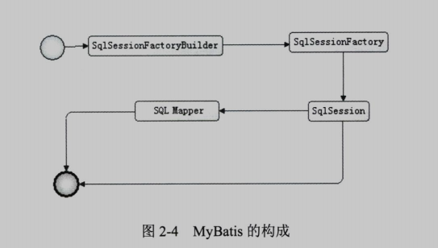
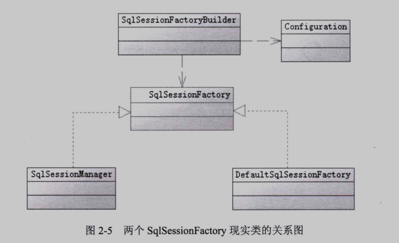

# Mybatis 相关内容整理
## 1. 简介
    一款优秀的半自动化持久层的ORM框架，支持自定义 SQL、存储过程以及高级映射。
    通过简单的 XML 或注解来配置和映射原始类型、接口和 Java POJO 为数据库中的记录。
    免除了几乎所有的 JDBC 代码以及设置参数和获取结果集的工作，大大简化了开发工作。

## 2. 基本构成

* SqlSessionFactoryBuilder
    根据配置信息等多种方式生成 SqlSessionFactory 工厂对象。
* SqlSessionFactory
    依靠工厂对象生成 SqlSession 会话。
* SqlSession
    一个既可以发送SQL去执行并返回结果，也可以获取 Mapper 的接口。
* SQL Mapper
    Mybatis 新设计的组件，有 Java 接口和对应 XML 文件（或注解）构成，需要给出对应的 SQL 和映射规则。

### 2.1 构建 SqlSessionFactory
    Mybatis 应用都是以 SqlSessionFactory 的实力为中心的。SqlSessionFactory 则由 SqlSessionFactoryBuilder 获得。
    SqlSessionFactoryBuilder 根据 XML 配置文件生成的 Configuration 对象构建 SqlSessionFactory 实例 DefaultSqlSessionFactory。

