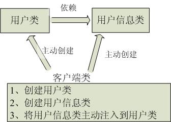
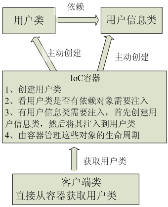

## Spring IOC相关内容整理
### 1. IOC简介
    Inversion of Control，控制反转，把创建和查找依赖对象的控制权交给了容器，由容器进行注入组合对象；
    理解好Ioc的关键是要明确“谁控制谁，控制什么，为何是反转，哪些方面反转了”

* 谁控制谁，控制什么
  > 传统Java SE程序设计，我们直接在对象内部通过new进行创建对象，是程序主动去创建依赖对象；而IoC是有专门一个容器来创建这些对象，即由Ioc容器来控制对象的创建；
  >  谁控制谁？当然是IoC 容器控制了对象；
  >  控制什么？那就是主要控制了外部资源获取（不只是对象包括比如文件等）。
* 为何是反转，哪些方面反转了
  > 有反转就有正转，传统应用程序是由我们自己在对象中主动控制去直接获取依赖对象，也就是正转；而反转则是由容器来帮忙创建及注入依赖对象；
  >  为何是反转？因为由容器帮我们查找及注入依赖对象，对象只是被动的接受依赖对象，所以是反转；
  >  哪些方面反转了？获得依赖对象的过程被反转了。

### 2. 使用IOC前后对比图
1. 传统应用程序示意图
    
2. IoC/DI容器后程序结构示意图
    

